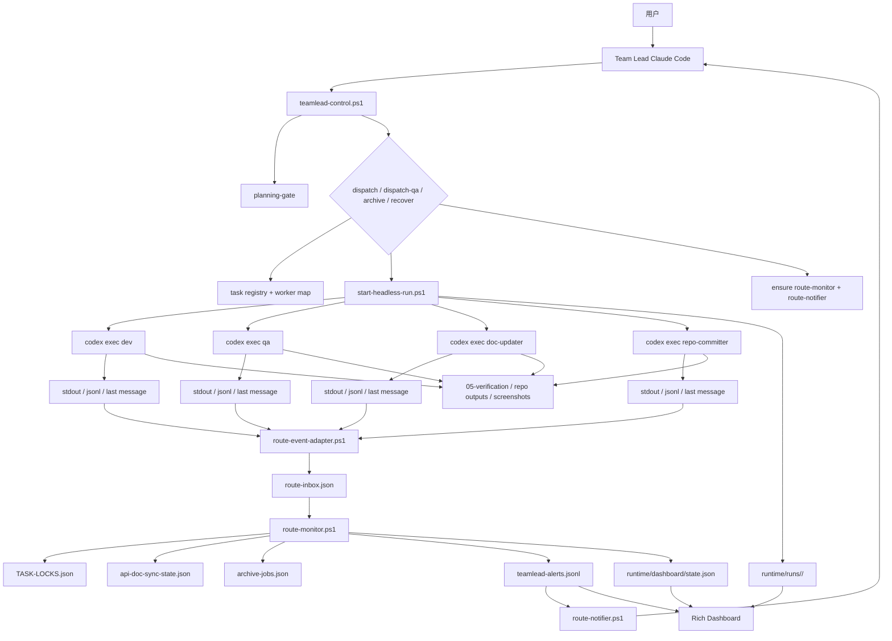
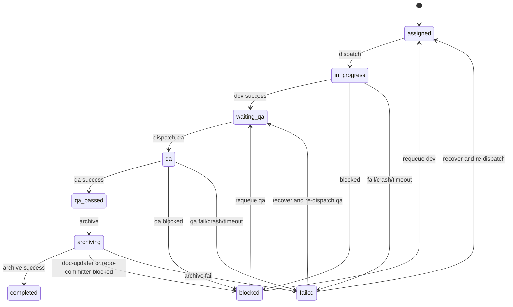
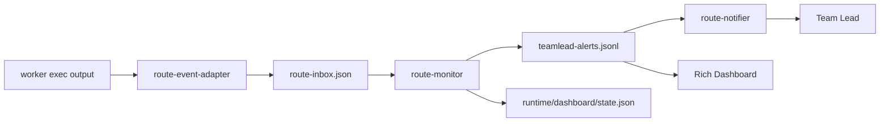

# Headless 编排架构设计（Windows 过渡版）

本文档描述 `E:\moxton-ccb` 从“基于 WezTerm pane 的交互式多 worker 编排”迁移到“Team Lead 交互式 + Worker Headless 执行”的目标架构。

## 设计目标

- 保留 Team Lead 的交互式决策体验
- 将 Dev / QA / doc-updater / repo-committer 统一改造成 headless worker
- 用结构化事件替代 pane 文本监听
- 用统一运行态目录替代散落的终端现场状态
- 用 `route-monitor` 做唯一状态收口者
- 用 `route-notifier` 做唯一 Team Lead 唤醒器
- 为后续接入 Rich 指挥大屏预留稳定数据源

## 当前实施状态（阶段 1）

当前代码已落地两层 headless 能力：`doc-updater` / `repo-committer` 通过 `scripts/start-headless-run.ps1` 走 headless `codex exec`，并且 `backend-dev` 已通过 `dispatch_mode=headless` 接入控制器主链。

当前仍保留交互式链路的部分：

- `backend-dev` 已改为 headless 派遣；其余 dev / qa 仍基于 WezTerm pane 派遣
- Team Lead 仍通过现有 Claude Code 交互会话工作
- route-monitor 与 route-notifier 继续沿用现有收口与提醒链路

这意味着第一阶段的目标不是全量去 WezTerm，而是先验证：后台 headless 执行、运行态落盘、route 收口、Team Lead 通知这条链路可以脱离 worker pane。

当前已完成的 smoke 验证：

- HEADLESS-SMOKE-003：验证 doc-updater headless 运行、report_route ACK / blocked、events.jsonl UTF-8 落盘、state.json 成功终态
- HEADLESS-SMOKE-REPO-002：验证 repo-committer headless 运行、report_route ACK / blocked、events.jsonl UTF-8 落盘、state.json 成功终态
- `BACKEND` 的 `dev_dispatch_mode` 已切到 `headless`，可通过 `dispatch --DryRun` 看到 `Mode: headless`

## 为什么要改造

当前交互式 pane 编排存在以下天然问题：

- 依赖 WezTerm pane 和文本匹配，容易漏看、漂移或乱码
- 终端崩溃后恢复复杂，Worker 现场状态不可追踪
- Team Lead 的通知稳定性依赖 watcher 与 send-text 时机
- Worker 越多，pane 观察成本越高，状态越容易脏
- 审批弹窗已经大幅收缩后，pane watcher 的主链价值显著下降

当前系统真正的核心需求已经收敛为：

- Worker 按协议执行
- Worker 产出结构化进度与终态
- 控制器可靠收口
- Team Lead 及时收到通知并做决策

## 目标架构总览



## 角色职责

### Team Lead

只负责：

- 需求澄清
- 任务规划
- 派遣与回退
- 人工决策
- 归档确认

不再负责：

- 盯 WezTerm pane 文本输出
- 通过终端现场判断 worker 是否卡住
- 依赖 watcher 扫 pane 才知道 worker 已回传

### Headless Runner

负责：

- 启动 `codex exec`
- 记录 `task_id / run_id / worker / role / pid`
- 写运行态目录
- 记录心跳与退出码
- 检测崩溃、超时、无输出

### Route Event Adapter

负责：

- 把 `codex exec` 输出流翻译成统一事件
- 补齐 `in_progress`、`success`、`blocked`、`fail` 语义
- 统一写入 `route-inbox.json`

### Route Monitor

唯一收口者：

- 读取 `route-inbox.json`
- 校验 `run_id`
- 更新 `TASK-LOCKS.json`
- 推进 `api-doc-sync-state.json`
- 推进 `archive-jobs.json`
- 生成 `teamlead-alerts.jsonl`

### Route Notifier

唯一唤醒器：

- 读取 `teamlead-alerts.jsonl`
- 将提醒送达 Team Lead
- 记录 delivery 成功与失败

### Dashboard

只读展示层：

- 不写锁
- 不派遣
- 不做状态推进
- 只展示运行态、告警与建议动作

## 运行态目录设计

建议新增：

```text
runtime/
  dashboard/
    state.json
    alerts.jsonl
  runs/
    BACKEND-014/
      run-20260322-001/
        meta.json
        state.json
        events.jsonl
        stdout.log
        stderr.log
        final-message.md
        exit-code.txt
        changed-files.json
        evidence-index.json
```

### meta.json

记录固定元信息：

- `task_id`
- `run_id`
- `role`
- `worker`
- `engine`
- `model`
- `cwd`
- `started_at`

### state.json

记录当前运行态：

- `phase`
- `status`
- `heartbeat_at`
- `last_output_at`
- `last_route_at`
- `last_command`
- `last_changed_files`
- `exit_code`
- `next_action_hint`

### events.jsonl

记录结构化事件流，供 `route-monitor`、Rich Dashboard、恢复逻辑和审计复盘复用。

## 统一事件模型

建议统一为以下事件类型：

- `run_started`
- `run_heartbeat`
- `tool_command`
- `files_changed`
- `evidence_written`
- `route_in_progress`
- `route_blocked`
- `route_success`
- `route_fail`
- `run_timeout`
- `run_crashed`
- `run_finished`

示例：

```json
{
  "ts": "2026-03-22T12:00:00+08:00",
  "task_id": "BACKEND-014",
  "run_id": "run-20260322-001",
  "worker": "backend-dev",
  "role": "dev",
  "event": "files_changed",
  "summary": "modified src/modules/order/payment.ts",
  "payload": {}
}
```

约束：

- 所有 route 相关事件都必须带 `task_id + run_id + worker + role`
- `route-monitor` 只认当前任务锁上绑定的有效 `run_id`
- 迟到事件只能落日志，不能反向写坏主状态

## 任务状态流转



说明：

- `failed` 表示 headless 运行层异常，例如 crash、超时、退出码异常
- `blocked` 表示 worker 明确上报阻塞，需要 Team Lead 做业务或环境决策
- `qa_passed` 仍然是人工复审前的缓冲态

## 通知链路



通知原则：

- Worker 不直接负责“唤醒 Team Lead”
- Worker 只负责产出执行结果和结构化事件
- Team Lead 的通知必须由系统层统一发送
- `route-monitor` 只收口，不直接做最后一跳送达
- `route-notifier` 失败时必须单独记录 delivery failure

## Rich 指挥大屏设计

Rich 只作为只读态势板，不直接做调度控制。

建议布局：

```text
+--------------------------------------------------------------+
| Team Lead 总览                                               |
| active tasks | blocked | waiting_qa | qa_passed | alerts     |
+------------------------------+-------------------------------+
| Worker Runs                  | Alerts / Decisions            |
| task/run/phase/heartbeat     | latest blocked/fail/ready     |
| current command/files        | what team lead should do next |
+------------------------------+-------------------------------+
| Evidence / Changes           | System Health                 |
| changed files / screenshots  | route-monitor/notifier/runs   |
| test reports / doc sync      | stale runs / delivery fail    |
+------------------------------+-------------------------------+
```

大屏展示重点：

- 当前任务谁在跑
- 最近心跳
- 最近命令
- 最近修改文件
- 最近 route
- 是否 blocked / fail
- Team Lead 下一步应该做什么

不展示目标：

- 模型完整思维链
- 终端逐字符输出还原
- 作为主控制台直接派遣任务

## 与现有架构的映射关系

### 保留

- `scripts/teamlead-control.ps1`
- `scripts/route-monitor.ps1`
- `scripts/route-notifier.ps1`
- `01-tasks/TASK-LOCKS.json`
- `config/api-doc-sync-state.json`
- `config/archive-jobs.json`
- `config/teamlead-alerts.jsonl`

### 弱化或移除

- `worker-panels.json` 的主链地位
- WezTerm pane 作为执行现场的中心角色
- `pane-approval-watcher` 的主链职责
- 文本匹配式 watcher
- Agent Team / notify-sentinel 类通知链路

### 新增

- `scripts/start-headless-run.ps1`
- `scripts/route-event-adapter.ps1`
- `runtime/*`
- `dashboard.py` 或同等展示层

## 关键风险

### 1. `codex exec` 中间态不够丰富

应对：

- Runner 自己补心跳
- 定期记录最近输出摘要
- 定期做 `git diff --name-only`
- 必要时采集最近命令摘要

### 2. Worker 崩溃后没有现场 pane 可看

应对：

- 强制保存 `stdout.log`
- 强制保存 `stderr.log`
- 强制保存 `exit-code.txt`
- 自动生成 `run_crashed` 事件

### 3. Route 已收口但 Team Lead 未被唤醒

应对：

- `route-notifier` 独立部署
- delivery 成功和失败分开记录
- Dashboard 明确显示“已收口未送达”

### 4. Team Lead 看到 blocked 后只会重派，不会先修环境

应对：

blocked 事件强制结构化字段：

- `blocker_type`
- `resource`
- `attempted`
- `next_action_needed`

### 5. 多 run 并发时旧事件回写脏状态

应对：

- 一切状态推进按 `run_id` 收口
- 锁只绑定当前有效 run
- 旧 route 只能进日志，不能改当前锁

## 迁移路径

建议分阶段推进，不要一次性全切。


### 阶段 1

- 保持现有主链可运行
- 只补架构文档、事件模型和运行态目录设计

### 阶段 2

- 先把 `doc-updater` 和 `repo-committer` 改成 headless
- 验证 route 收口与通知链不依赖 pane

### 阶段 3

- 后端 dev 改 headless
- 验证开发任务的进度、成功、失败、阻塞闭环

### 阶段 4

- 前端 dev 改 headless
- 补充文件改动、截图、构建日志采集

### 阶段 5

- QA 改 headless
- 统一验收报告、证据采集和 route 成功标准

### 阶段 6

- 下线 pane watcher 的主链职责
- 仅保留为兼容或临时救火工具

### 阶段 7

- 接入 Rich Dashboard
- 让 Team Lead 从“盯 pane”切换为“看态势板”


## 阶段 3 前的第二阶段实施设计

这一阶段的目标不是“一次性把所有 worker 全切掉”，而是把 `dispatch / dispatch-qa` 的执行层从 WezTerm pane 改成可灰度开启的 headless runner，同时保持 Team Lead、`route-monitor`、`route-notifier` 和任务锁模型不变。

### 第二阶段的改造边界

只动以下边界：

- `dispatch` 与 `dispatch-qa` 的 worker 启动方式
- `worker-map.json` 中每个角色的派遣模式配置
- `runtime/runs/*` 下 dev / qa 的运行态落盘
- `recover/status` 对 headless run 的观测与恢复提示

暂时不动：

- `route-monitor` 的收口职责
- `route-notifier` 的 Team Lead 唤醒职责
- `TASK-LOCKS.json` 的状态模型
- `report_route` 协议
- Team Lead 的交互式工作方式

### 推荐的控制器改造方式

建议在 `config/worker-map.json` 为每类 worker 增加 `dispatch_mode`：

- `pane`：沿用现有 WezTerm pane 派遣
- `headless`：走 `scripts/start-headless-run.ps1`

初始灰度建议：

- `backend-dev`：先支持 `headless`，作为第一批真实业务验证
- `shop-fe-dev` / `admin-fe-dev`：先保留 `pane`
- `backend-qa` / `shop-fe-qa` / `admin-fe-qa`：先保留 `pane`

这样可以先验证“开发链路 headless 化”，而不会同时把 QA 证据链也一起改爆。

### dispatch / dispatch-qa 的目标形态

控制器未来应按同一套逻辑派遣：

1. 读取任务锁与依赖门禁
2. 读取 `worker-map.json`，拿到 `engine + dispatch_mode + workdir`
3. 生成新的 `run_id`
4. 若 `dispatch_mode=pane`，继续走旧的 `dispatch-task.ps1`
5. 若 `dispatch_mode=headless`，改走 `start-headless-run.ps1`
6. 只有在实际派遣成功后才写任务锁并绑定当前 `run_id`

这样可以做到：

- 同一套锁模型兼容 pane 与 headless
- 可以按角色逐个灰度
- 出问题时只需把 `dispatch_mode` 改回 `pane`

### 第二阶段必须补齐的运行态字段

当 dev / qa 也进入 headless 后，`runtime/runs/<task>/<run_id>/state.json` 至少要补齐这些字段：

- `task_id`
- `run_id`
- `worker`
- `role`
- `status`
- `phase`
- `started_at`
- `heartbeat_at`
- `last_output_at`
- `last_route_at`
- `last_changed_files`
- `exit_code`
- `next_action_hint`

其中最关键的是：

- `heartbeat_at`：判断是否真的卡住
- `last_route_at`：区分“仍在干活但还没回传”与“完全失联”
- `next_action_hint`：给 Team Lead 在 `status` 中直接展示建议动作

### 第二阶段的卡住/崩溃判定

不要再依赖“pane 没输出”来判断。

建议统一为：

- `stalled`：进程还活着，但超过阈值没有新输出且没有新 route
- `crashed`：子进程退出码异常或进程意外消失
- `blocked`：worker 主动通过 `report_route(status=blocked)` 上报

`status` / `recover` 给 Team Lead 的动作建议应直接区分：

- `blocked(env)`：先修环境，再 `requeue + redispatch`
- `stalled`：先看最近输出与最后命令，再决定 `terminate + redispatch`
- `crashed`：直接按运行层故障处理，不要当成业务阻塞

### QA headless 化前的前置条件

在 QA 迁移到 headless 之前，至少要先解决三件事：

- 证据索引：把截图、network、console、报告路径统一写进 `evidence-index.json`
- 失败分类：让 `route-monitor` 能区分“测试失败”与“环境不可用”
- 端口/服务探活：在 QA runner 前置做健康检查，避免 QA 一上来就盲跑再阻塞

否则 QA 改成 headless 后，Team Lead 只会更频繁地看到“重派后再次阻塞”。

### 第二阶段的恢复策略

建议把恢复动作分成两层：

- 业务层恢复：`requeue -TargetState assigned|waiting_qa`
- 运行层恢复：回收失联 run、杀死残留进程、重新派遣

`recover` 的输出应明确告诉 Team Lead：

- 当前锁绑定的有效 `run_id`
- 最近一次成功心跳时间
- 最近一次 route 时间
- 是否检测到残留进程
- 建议执行 `dispatch` 还是先修环境

### 第二阶段完成的判定标准

当以下条件都满足时，才算第二阶段真正完成：

- 至少一个真实 dev 角色长期运行在 headless 模式
- `status` 不再依赖 pane 文本也能判断 run 健康度，并显示 `runtime / pid / proc / rt_last / run_dir / note` 摘要
- route 收口、任务锁推进、Team Lead 通知链不需要为 headless 额外分叉
- 出现 crash / stalled / blocked 时，Team Lead 能从 `status` 直接得到下一步建议

达到这一点后，再进入“阶段 3：真实业务 dev headless 灰度”和“阶段 5：QA headless 化”，风险会小很多。

## 最终建议

对于当前 `moxton-ccb`，推荐的目标形态不是单纯“去掉终端窗口”，而是：

- 执行层 headless 化
- 状态层结构化
- 通知层解耦
- 观测层大屏化

在 Windows 原生环境下，`headless` 已经会比当前交互式 pane 编排稳定得多；若未来迁移到 WSL / Linux runner，则稳定性还会进一步提升。