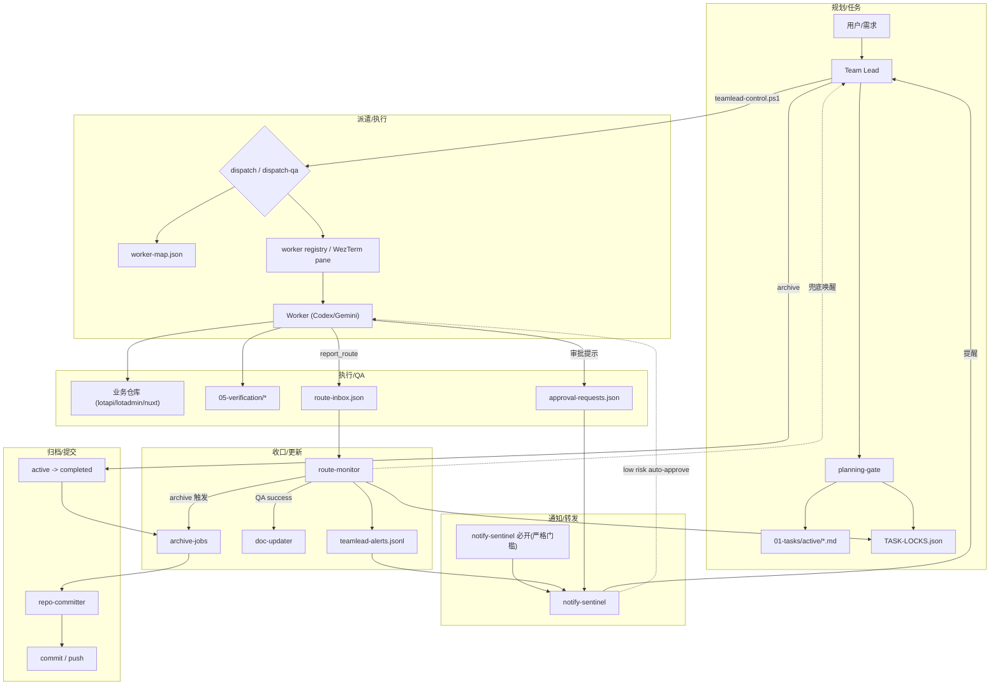

# Moxton-CCB 指挥中心

多 AI 协作的任务编排系统，协调三个业务仓库的开发工作。

## 架构

## 编排流程图




- **Team Lead**：Claude Code 会话（本仓库）— 需求拆分、任务分派、进度监控
- **主指挥约束**：Team Lead 只能使用 Claude Code（禁止 Codex 作为主指挥）
- **Workers**：Codex / Gemini CLI — 在 WezTerm 多窗口中执行开发和 QA
- **通信**：MCP `report_route` 回调 + Agent Teams 通知（审批/上报）+ WezTerm CLI `send-text`（仅 CLI/WezTerm 场景，Team Lead 唤醒默认开启（可用 CCB_ENABLE_WEZTERM_NOTIFY=0 关闭））
- **控制入口**：`scripts/teamlead-control.ps1`（业务动作统一入口）

## 业务仓库

| 前缀 | 仓库 | Dev 引擎 | QA 引擎 |
|------|------|---------|---------|
| BACKEND | `E:\moxton-lotapi` | Codex (`-a never --sandbox danger-full-access`) | Codex (`-a never --sandbox danger-full-access`) |
| ADMIN-FE | `E:\moxton-lotadmin` | Codex (`-a never --sandbox danger-full-access`) | Codex (`-a never --sandbox danger-full-access`) |
| SHOP-FE | `E:\nuxt-moxton` | Codex (`-a never --sandbox danger-full-access`) | Codex (`-a never --sandbox danger-full-access`) |

## 使用方式

所有操作通过统一控制器 `scripts/teamlead-control.ps1`：

```bash
# 新会话第一步
powershell -NoProfile -ExecutionPolicy Bypass -File "E:\moxton-ccb\scripts\teamlead-control.ps1" -Action bootstrap

# 派遣任务
... -Action dispatch -TaskId BACKEND-010
... -Action dispatch -TaskId BACKEND-010 -DispatchEngine codex
... -Action dispatch-qa -TaskId BACKEND-010

# QA 通过后保持 qa_passed，等待人工复审
... -Action qa-pass -TaskId BACKEND-010

# 复审驳回后回退但不自动派遣
... -Action requeue -TaskId BACKEND-010 -TargetState waiting_qa -RequeueReason "review_reject"

# 查看状态
... -Action status
... -Action show-approval -RequestId APR-20260228120000-0001
```

派遣规则（强约束）：
- `dispatch/dispatch-qa` 必须串行执行（一次只执行一条）。
- 不要并行启动两条 dispatch 命令；同角色并发由控制器自动分配 worker pool 实例。
- 引擎默认来自 `worker-map.json`，可用 `-DispatchEngine codex|gemini` 做单次覆盖。
- `baseline-clean` 改为手动触发；控制器不会在每次派遣前自动清理 pending route / approval。
- `prune-orphan-locks` 用于清理“任务文件在 `active/` 和 `completed/` 都不存在”的孤立锁；不要再用临时脚本直改 `TASK-LOCKS.json`。
- `requeue` 只做“记录 + 改状态”，不会自动通知旧 worker，也不会自动重新派遣。
- `qa-pass` 用于“保持/校正为 qa_passed，等待人工复审”；不要把“保持 qa_passed”误翻译成 `requeue -TargetState qa_passed`。
- QA 复审驳回后，默认 `requeue -> dispatch-qa`，并使用 fresh QA context。
- 每次 `dispatch/dispatch-qa` 都会生成新的 `run_id`；Worker 回传 `report_route` 时必须原样带回。
- `route-monitor` 会基于 `run_id + 当前锁状态` 忽略旧 worker 迟到 route，避免状态被写回漂移。
- `dispatch/dispatch-qa` 只自动确保 `route-monitor` 常驻；审批/上报通知由 Agent Teams 通知队友负责。
- `route-monitor` 负责状态收口与任务锁更新；通知队友只做提醒，不写状态。
- 前端链路保留 `Playwright` 作为 smoke/回归基座，同时加入 `agent-browser` 作为真实浏览器交互验收增强层；不做替换。
- `agent-browser` 是命令式 CLI：单次 `open/snapshot/screenshot/...` 执行完就退出是正常行为；验收证据以输出文件（截图/console/network）为准。
- `agent-browser` 统一全局安装在 worker 所在机器环境中，不分别安装到 `nuxt-moxton` / `moxton-lotadmin` 仓库。
- 涉及登录/权限/真实数据流的 dev 和 QA 自测，统一先读 `05-verification/QA-IDENTITY-POOL.md`，优先使用固定测试凭据，禁止默认注册新账号探路。

详细工作流程见 [CLAUDE.md](./CLAUDE.md)。

## Claude Code UI（可选）

本 UI 仅作为 Claude Code CLI 的可视化壳，不改变能力边界。默认只读使用，不要在 UI 中运行派遣/改锁类命令。

```bash
# 全局安装
npm i -g @siteboon/claude-code-ui@latest

# 本机启动（仅本机访问）
powershell -NoProfile -ExecutionPolicy Bypass -File "E:\moxton-ccb\scripts\start-claudecodeui.ps1"

# 启动并允许局域网访问（手机同网段访问）
powershell -NoProfile -ExecutionPolicy Bypass -File "E:\moxton-ccb\scripts\start-claudecodeui.ps1" -Public
```

局域网访问时，用 `http://<你的电脑内网IP>:3001` 打开；如需 WezTerm pane 启动，追加 `-UseWezTerm`。


## Agent Teams 通知（推荐）


默认严格门槛：派遣前必须创建 notify-sentinel；未创建将被控制器阻断。
若禁用 route-monitor 唤醒（`CCB_ROUTE_MONITOR_NOTIFY=0`），通知完全依赖 notify-sentinel。
解决 Claude Code UI/手机端无法接收 WezTerm `send-text` 唤醒的问题。通知队友只做提醒，不改状态。

启用方式（实验特性）：
- 在 settings.json 或环境变量中设置 CLAUDE_CODE_EXPERIMENTAL_AGENT_TEAMS=1
- 推荐 teammateMode: in-process（不打开新窗口）
- WezTerm 通知唤醒默认开启，如需关闭设置 `CCB_ENABLE_WEZTERM_NOTIFY=0`

启动方式（Team Lead 会话内自然语言即可）：
- 创建团队，添加一个 notify-sentinel teammate
- 指令其阅读 E:\moxton-ccb\.claude\agents\notify-sentinel.md 并开始循环监听
- notify-sentinel 启动后必须输出一次 `[WATCH-READY]` 并写入 `config/notify-sentinel.ready.json`
- 若未写入，执行 `powershell -NoProfile -ExecutionPolicy Bypass -File "E:\moxton-ccb\scripts\teamlead-control.ps1" -Action notify-ready` 补写（dispatch/dispatch-qa 门禁依赖该标记）

## 技能链路（Team Lead）

- **规划阶段**：`planning-gate`
  - 需求澄清 -> 方案对比 -> 任务文档落地
  - 只读 `E:\moxton-ccb` 文档中心，默认不扫描三业务仓代码
  - 最终产物必须落到 `01-tasks/active/<domain>/<TASK-ID>.md`
  - 禁止把 `docs/plans/*` 作为执行输入
- **执行阶段**：`teamlead-controller`
  - `status -> dispatch/dispatch-qa -> archive`
  - 统一调用 `teamlead-control.ps1`，禁止手工派遣
- **模板辅助**：`development-plan-guide`
  - 任务模板、命名规范、跨角色拆分参考

技能说明见 [.claude/skills/README.md](./.claude/skills/README.md)。

## 关键约束

- 禁止 Team Lead 使用子代理（`Task(...)` / `Backgrounded agent`）执行派遣；允许 Agent Teams `notify-sentinel` 仅做通知。
- 禁止直接调用控制器子脚本（如 `dispatch-task.ps1` / `start-worker.ps1`）。
- 禁止 Team Lead 直接使用 `assign_task.py` 执行写入动作（建任务/改锁/拆分）；仅允许只读诊断参数。
- Worker 遇阻塞必须 `report_route(status=blocked, ...)`，不得静默等待。
- QA 回传 `status=success` 时，`body` 必须是 JSON 结构化证据；不合规会被 route-monitor 自动降级为 `blocked`。
- QA worker 不得调用 `teamlead-control.ps1`、不得直接编辑 `TASK-LOCKS.json`、不得向用户询问“归档还是 qa_passed”这类编排决策。
- QA 通过不自动提交；仅在 `archive` 成功迁移 `active -> completed` 后触发提交发布流程。
- QA 通过后若复审不通过，先 `requeue -TargetState waiting_qa`，不要把驳回原因直接发到旧 QA 窗口。
- 前端 QA 默认顺序：`Playwright smoke -> agent-browser 真实交互验收 -> playwright-mcp/截图/网络证据补充`。
- Team Lead 监控 Worker 时禁止无限轮询：同一 `get-text/check_routes` 无变化最多 3 轮，随后必须转 `status/recover`。
- 高风险审批与 MCP 上报由 Agent Teams 通知队友发送提醒（示例格式见 CLAUDE.md）。

## 目录结构

```
01-tasks/          任务文档与锁（含任务主记录与 QA 摘要回写）
02-api/            API 参考文档
03-guides/         技术指南
04-projects/       项目文档与协调关系
05-verification/   QA 验证报告与原始证据
config/            配置（worker-map、approval-policy）
scripts/           控制器与工具脚本
mcp/route-server/  MCP 路由服务（report_route / check_routes / clear_route）
```


