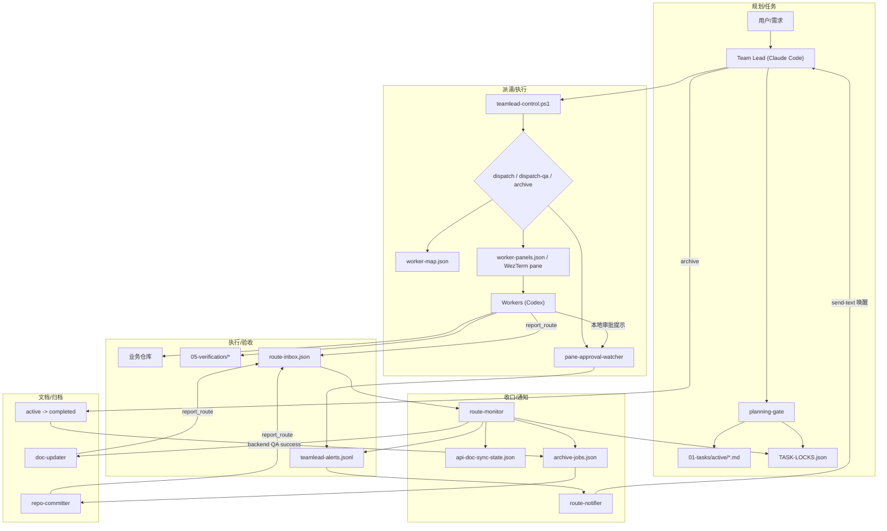

# Moxton-CCB 指挥中心

多 AI 协作的任务编排系统，协调三个业务仓库的开发工作。

## 架构

## 编排流程图



- **Team Lead**：Claude Code 会话（本仓库）— 需求拆分、任务分派、进度监控
- **主指挥约束**：Team Lead 只能使用 Claude Code（禁止 Codex 作为主指挥）
- **Workers**：当前业务主链与辅助 worker 均默认走 headless `codex exec`。`backend-dev`、`shop-fe-dev`、`admin-fe-dev`、`backend-qa`、`shop-fe-qa`、`admin-fe-qa`、`doc-updater`、`repo-committer` 都已接入 headless runner；WezTerm pane 仅保留兼容回退用途。
- **通信**：统一走 MCP `report_route` 回传 + WezTerm CLI `send-text` 唤醒。`route-monitor` 负责收口、写锁、文档/归档状态更新与事件落盘；`route-notifier` 独立负责唤醒 Team Lead；`pane-approval-watcher` 仅保留给 pane worker 的本地审批兼容。

- **控制入口**：`scripts/teamlead-control.ps1`（业务动作统一入口）

## 业务仓库


| 前缀 | 仓库 | Dev 引擎 | QA 引擎 |
|------|------|---------|---------|
| BACKEND | `E:\moxton-lotapi` | Codex (`-a never --sandbox danger-full-access`) | Codex (`-a never --sandbox danger-full-access`) |
| ADMIN-FE | `E:\moxton-lotadmin` | Codex (`-a never --sandbox danger-full-access`) | Codex (`-a never --sandbox danger-full-access`) |
| SHOP-FE | `E:\nuxt-moxton` | Codex (`-a never --sandbox danger-full-access`) | Codex (`-a never --sandbox danger-full-access`) |


## 当前迁移状态（默认 headless）

当前主链默认已切到 headless，保留 WezTerm pane 作为兼容回退：

- Team Lead：仍然是 `E:\moxton-ccb` 内的 Claude Code 交互式会话
- Dev / QA：`backend-dev`、`shop-fe-dev`、`admin-fe-dev`、`backend-qa`、`shop-fe-qa`、`admin-fe-qa` 已统一通过 `dispatch / dispatch-qa` 走 headless
- `doc-updater` / `repo-committer`：已通过 `scripts/start-headless-run.ps1` 走 headless `codex exec`
- 状态收口：统一仍由 `route-monitor` 处理
- Team Lead 唤醒：统一仍由 `route-notifier` 处理
- 状态观测：`status` 已能直接读取 headless run 的 `state.json`，显示 `runtime / pid / proc / rt_last / run_dir / note`

这意味着当前版本已经把业务主链与辅助链路一起从 pane 中剥离出来，形成“Team Lead 交互式决策 + worker headless 执行”的默认架构；WezTerm pane 只作为回退与人工调试通道保留。

完整设计见 [HEADLESS-ORCHESTRATION-ARCHITECTURE.md](./HEADLESS-ORCHESTRATION-ARCHITECTURE.md)。

## 使用方式

所有操作通过统一控制器 `scripts/teamlead-control.ps1`：

```bash
# 新会话第一步
powershell -NoProfile -ExecutionPolicy Bypass -File "E:\moxton-ccb\scripts\teamlead-control.ps1" -Action bootstrap

# 派遣任务
... -Action dispatch -TaskId BACKEND-010
... -Action dispatch -TaskId BACKEND-010 -DispatchEngine codex
... -Action dispatch-qa -TaskId BACKEND-010

# QA 通过后保持 qa_passed，等待人工复审
... -Action qa-pass -TaskId BACKEND-010

# 复审驳回后回退但不自动派遣
... -Action requeue -TaskId BACKEND-010 -TargetState waiting_qa -RequeueReason "review_reject"

# 查看状态
... -Action status
... -Action show-approval -RequestId APR-20260228120000-0001
```

派遣规则（强约束）：
- `dispatch/dispatch-qa` 必须串行执行（一次只执行一条）。
- 不要并行启动两条 dispatch 命令；同角色并发由控制器自动分配 worker pool 实例。
- 引擎默认来自 `worker-map.json`，可用 `-DispatchEngine codex|gemini` 做单次覆盖。
- `baseline-clean` 改为手动触发；控制器不会在每次派遣前自动清理 pending route / approval。
- `prune-orphan-locks` 用于清理“任务文件在 `active/` 和 `completed/` 都不存在”的孤立锁；不要再用临时脚本直改 `TASK-LOCKS.json`。
- `requeue` 只做“记录 + 改状态”，不会自动通知旧 worker，也不会自动重新派遣。
- `requeue/reset-task` 现在会清空旧 `run_id / assigned_worker / headless_pid / headless_run_dir / pane_id / dispatch_mode`，避免脏运行态残留。
- 对 headless 任务，优先使用 `recover -RecoverAction restart-task -TaskId <ID>` 做任务级恢复，再重新 `dispatch / dispatch-qa`；不要对失败运行反复直接 `requeue`。
- `dispatch / dispatch-qa` 现在会在派遣前硬拦截残留运行态；若 `assigned / waiting_qa` 仍带旧 `run_id / pid / run_dir / assigned_worker`，必须先 `restart-task`。
- `qa-pass` 用于“保持/校正为 qa_passed，等待人工复审”；不要把“保持 qa_passed”误翻译成 `requeue -TargetState qa_passed`。
- QA 复审驳回后，默认 `requeue -> dispatch-qa`，并使用 fresh QA context。
- 每次 `dispatch/dispatch-qa` 都会生成新的 `run_id`；Worker 回传 `report_route` 时必须原样带回。
- `route-monitor` 会基于 `run_id + 当前锁状态` 忽略旧 worker 迟到 route，避免状态被写回漂移。
- `dispatch/dispatch-qa` 会自动确保 `route-monitor` 与 `route-notifier` 常驻；MCP route 上报先由 `route-monitor` 收口，再由 `route-notifier` 唤醒 Team Lead。`doc-updater` / `repo-committer` 也走同一条链路。
- 所有通过 Team Lead 派遣的 worker 都必须按协议回传 `in_progress` 与终态（`success` / `blocked` / `fail`）；其中 `doc-updater` / `repo-committer` 的 `in_progress` 也会触发提醒，避免文档/归档链路静默运行。
- `route-monitor` 只负责状态收口、任务锁更新和事件落盘；`route-notifier` 独立负责 Team Lead 唤醒。`config/teamlead-delivery.jsonl` / `config/teamlead-delivery-failures.jsonl` 用于区分“route 已收口”与“最后一跳通知失败”。
- 前端链路保留 `Playwright` 作为 smoke/回归基座，同时加入 `agent-browser` 作为真实浏览器交互验收增强层；不做替换。
- `agent-browser` 是命令式 CLI：单次 `open/snapshot/screenshot/...` 执行完就退出是正常行为；验收证据以输出文件（截图/console/network）为准。
- `agent-browser` 统一全局安装在 worker 所在机器环境中，不分别安装到 `nuxt-moxton` / `moxton-lotadmin` 仓库。
- 涉及登录/权限/真实数据流的 dev 和 QA 自测，统一先读 `05-verification/QA-IDENTITY-POOL.md`，优先使用固定测试凭据，禁止默认注册新账号探路。

详细工作流程见 [CLAUDE.md](./CLAUDE.md)。

## Rich 监控台（只读）

用于实时查看任务锁、headless 运行态、最近 `report_route` / Team Lead 唤醒记录、attempt 历史。该监控台只读，不参与派遣、改锁或决策。

```bash
# 实时监控（默认刷新 2 秒）
powershell -NoProfile -ExecutionPolicy Bypass -File "E:\moxton-ccb\scripts\start-rich-monitor.ps1"

# 只看某个任务
powershell -NoProfile -ExecutionPolicy Bypass -File "E:\moxton-ccb\scripts\start-rich-monitor.ps1" -TaskId SHOP-FE-013

# 渲染一次快照后退出
powershell -NoProfile -ExecutionPolicy Bypass -File "E:\moxton-ccb\scripts\start-rich-monitor.ps1" -Once
```

当前第一版面板包括：
- `TASK-LOCKS.json` 任务锁状态
- headless worker / runtime 状态与 PID
- 最近 route-notifier 投递记录
- 最近 task attempt / requeue / blocked 历史
- route-monitor / route-notifier watcher 心跳摘要

## Claude Code UI（可选）

本 UI 仅作为 Claude Code CLI 的可视化壳，不改变能力边界。默认只读使用，不要在 UI 中运行派遣/改锁类命令。

```bash
# 全局安装
npm i -g @siteboon/claude-code-ui@latest

# 本机启动（仅本机访问）
powershell -NoProfile -ExecutionPolicy Bypass -File "E:\moxton-ccb\scripts\start-claudecodeui.ps1"

# 启动并允许局域网访问（手机同网段访问）
powershell -NoProfile -ExecutionPolicy Bypass -File "E:\moxton-ccb\scripts\start-claudecodeui.ps1" -Public
```

局域网访问时，用 `http://<你的电脑内网IP>:3001` 打开；如需 WezTerm pane 启动，追加 `-UseWezTerm`。


## Team Lead 通知

默认由 `route-notifier` 通过 WezTerm `send-text` 唤醒 Team Lead；`route-monitor` 不再直接发送唤醒，只负责事件落盘。
所有经 Team Lead 派遣的 worker（含 `doc-updater` / `repo-committer`）只要按协议走 `report_route`，都会先被 `route-monitor` 收口，再由 `route-notifier` 唤醒 Team Lead。
本地 pane 审批由 `pane-approval-watcher` 负责兼容处理；高风险/未知审批会追加到 `teamlead-alerts.jsonl` 后再提醒 Team Lead。
如需关闭直接唤醒，设置 `CCB_ROUTE_MONITOR_NOTIFY=0`。
Agent Teams / `notify-sentinel` 已从主链移除，不再作为派遣前置门槛。

## 技能链路（Team Lead）


- **规划阶段**：`planning-gate`
  - 需求澄清 -> 方案对比 -> 任务文档落地
  - 只读 `E:\moxton-ccb` 文档中心，默认不扫描三业务仓代码
  - 最终产物必须落到 `01-tasks/active/<domain>/<TASK-ID>.md`
  - 禁止把 `docs/plans/*` 作为执行输入
- **执行阶段**：`teamlead-controller`
  - `status -> dispatch/dispatch-qa -> archive`
  - 统一调用 `teamlead-control.ps1`，禁止手工派遣
- **模板辅助**：`development-plan-guide`
  - 任务模板、命名规范、跨角色拆分参考

技能说明见 [.claude/skills/README.md](./.claude/skills/README.md)。

## 关键约束

- 禁止 Team Lead 使用子代理（`Task(...)` / `Backgrounded agent`）执行派遣。
- 禁止直接调用控制器子脚本（如 `dispatch-task.ps1` / `start-worker.ps1`）。
- 禁止 Team Lead 直接使用 `assign_task.py` 执行写入动作（建任务/改锁/拆分）；仅允许只读诊断参数。
- Worker 遇阻塞必须 `report_route(status=blocked, ...)`，不得静默等待。
- QA 回传 `status=success` 时，`body` 必须是 JSON 结构化证据；不合规会被 route-monitor 自动降级为 `blocked`。
- QA worker 不得调用 `teamlead-control.ps1`、不得直接编辑 `TASK-LOCKS.json`、不得向用户询问“归档还是 qa_passed”这类编排决策。
- QA 通过不自动提交；仅在 `archive` 成功迁移 `active -> completed` 后触发提交发布流程。
- QA 通过后若复审不通过，先 `requeue -TargetState waiting_qa`，不要把驳回原因直接发到旧 QA 窗口。
- QA 若以 `blocked` 回传环境/服务阻塞（如 `localhost:3033/health` 不可达），先恢复环境或派发环境恢复任务，再回到原任务继续 `requeue + dispatch-qa`；不要直接重派同一 QA。
- 前端 QA 默认顺序：`Playwright smoke -> agent-browser 真实交互验收 -> playwright-mcp/截图/网络证据补充`。
- Team Lead 监控 Worker 时禁止无限轮询：同一 `get-text/check_routes` 无变化最多 3 轮，随后必须转 `status/recover`。
- MCP 上报由 `route-notifier` 独立发送提醒；高风险审批相关命令仅做兼容保留。

## 目录结构

```
01-tasks/          任务文档与锁（含任务主记录与 QA 摘要回写）
02-api/            API 参考文档
03-guides/         技术指南
04-projects/       项目文档与协调关系
05-verification/   QA 验证报告与原始证据
config/            配置（worker-map、approval-policy）
scripts/           控制器与工具脚本
mcp/route-server/  MCP 路由服务（report_route / check_routes / clear_route）
```


