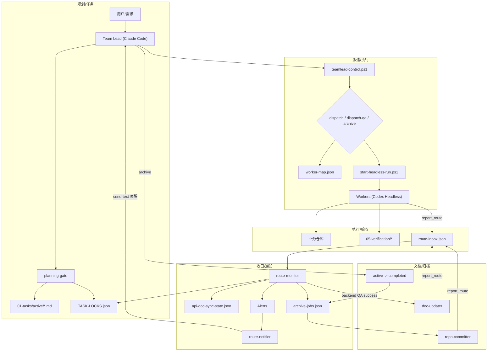

# Moxton-CCB 指挥中心

多 AI 协作的任务编排系统，协调三个业务仓库的开发工作。

## 架构

## 编排流程图



- **Team Lead**：Claude Code 会话（本仓库）— 需求拆分、任务分派、进度监控
- **主指挥约束**：Team Lead 只能使用 Claude Code（禁止 Codex 作为主指挥）
- **Workers**：当前业务主链与辅助 worker 均默认走 headless `codex exec`。`backend-dev`、`shop-fe-dev`、`admin-fe-dev`、`backend-qa`、`shop-fe-qa`、`admin-fe-qa`、`doc-updater`、`repo-committer` 都已接入 headless runner；WezTerm 主要承担 Team Lead 交互宿主、`route-notifier` 最后一跳唤醒和 Rich 看板右侧挂载。
- **通信**：统一走 MCP `report_route` 回传 + WezTerm CLI `send-text` 唤醒。`route-monitor` 负责收口、写锁、文档/归档状态更新与事件落盘；`route-notifier` 独立负责唤醒 Team Lead。

- **控制入口**：`scripts/teamlead-control.ps1`（业务动作统一入口）

## 业务仓库


| 前缀 | 仓库 | Dev 引擎 | QA 引擎 |
|------|------|---------|---------|
| BACKEND | `E:\moxton-lotapi` | Codex (`-a never --sandbox danger-full-access`) | Codex (`-a never --sandbox danger-full-access`) |
| ADMIN-FE | `E:\moxton-lotadmin` | Codex (`-a never --sandbox danger-full-access`) | Codex (`-a never --sandbox danger-full-access`) |
| SHOP-FE | `E:\nuxt-moxton` | Codex (`-a never --sandbox danger-full-access`) | Codex (`-a never --sandbox danger-full-access`) |


## 当前主链（默认 headless）

当前业务主链已经稳定在“Team Lead 交互式决策 + Worker Headless 执行”：

- Team Lead：仍然是 `E:\moxton-ccb` 内的 Claude Code 交互式会话
- Dev / QA：`backend-dev`、`shop-fe-dev`、`admin-fe-dev`、`backend-qa`、`shop-fe-qa`、`admin-fe-qa` 已统一通过 `dispatch / dispatch-qa` 走 headless
- `doc-updater` / `repo-committer`：已通过 `scripts/start-headless-run.ps1` 走 headless `codex exec`
- 状态收口：统一由 `route-monitor` 处理
- Team Lead 唤醒：统一由 `route-notifier` 处理
- 状态观测：`status` 已能直接读取 headless run 的 `state.json`，显示 `runtime / pid / proc / rt_last / run_dir / note`
- 运行保护：`bootstrap / dispatch / dispatch-qa` 会自动确保 `route-monitor`、`route-notifier`、`rich-monitor` 存活；若 watcher 心跳过期、pane 丢失或状态文件损坏，会自动重启

这意味着当前版本已经把业务主链与辅助链路一起从 worker pane 中剥离出来；WezTerm 不再承担 worker 执行现场，而是作为 Team Lead 交互与通知承载层保留。

## 使用方式

所有操作通过统一控制器 `scripts/teamlead-control.ps1`：

```bash
# 新会话第一步
powershell -NoProfile -ExecutionPolicy Bypass -File "E:\moxton-ccb\scripts\teamlead-control.ps1" -Action bootstrap

# 派遣任务
... -Action dispatch -TaskId BACKEND-010
... -Action dispatch -TaskId BACKEND-010 -DispatchEngine codex
... -Action dispatch-qa -TaskId BACKEND-010

# QA 通过后保持 qa_passed，等待人工复审
... -Action qa-pass -TaskId BACKEND-010

# 复审驳回后回退但不自动派遣
... -Action requeue -TaskId BACKEND-010 -TargetState waiting_qa -RequeueReason "review_reject"

# 查看状态
... -Action status
```

派遣规则（强约束）：
- `dispatch/dispatch-qa` 必须串行执行（一次只执行一条）。
- 不要并行启动两条 dispatch 命令；同角色并发由控制器自动分配 worker pool 实例。
- 引擎默认来自 `worker-map.json`，可用 `-DispatchEngine codex|gemini` 做单次覆盖。
- `baseline-clean` 改为手动触发；控制器不会在每次派遣前自动清理 pending route。
- `prune-orphan-locks` 用于清理“任务文件在 `active/` 和 `completed/` 都不存在”的孤立锁；不要再用临时脚本直改 `TASK-LOCKS.json`。
- `requeue` 只做“记录 + 改状态”，不会自动通知旧 worker，也不会自动重新派遣。
- `requeue/reset-task` 现在会清空旧 `run_id / assigned_worker / headless_pid / headless_run_dir / pane_id / dispatch_mode`，避免脏运行态残留。
- 对 headless 任务，优先使用 `recover -RecoverAction restart-task -TaskId <ID>` 做任务级恢复，再重新 `dispatch / dispatch-qa`；不要对失败运行反复直接 `requeue`。
- `dispatch / dispatch-qa` 现在会在派遣前硬拦截残留运行态；若 `assigned / waiting_qa` 仍带旧 `run_id / pid / run_dir / assigned_worker`，必须先 `restart-task`。
- `qa-pass` 用于“保持/校正为 qa_passed，等待人工复审”；不要把“保持 qa_passed”误翻译成 `requeue -TargetState qa_passed`。
- QA 复审驳回后，默认 `requeue -> dispatch-qa`，并使用 fresh QA context。
- 每次 `dispatch/dispatch-qa` 都会生成新的 `run_id`；Worker 回传 `report_route` 时必须原样带回。
- `route-monitor` 会基于 `run_id + 当前锁状态` 忽略旧 worker 迟到 route，避免状态被写回漂移。
- `dispatch/dispatch-qa` 会自动确保 `route-monitor` 与 `route-notifier` 常驻；MCP route 上报先由 `route-monitor` 收口，再由 `route-notifier` 唤醒 Team Lead。`doc-updater` / `repo-committer` 也走同一条链路。
- `dispatch/dispatch-qa/bootstrap` 现在会对 `route-monitor` / `route-notifier` / `rich-monitor` 做心跳判活；若检测到旧 PID 假活、pane 丢失或 `last_loop_at` 过期，会强制重启，避免“看起来在跑，实际上没工作”。
- 所有通过 Team Lead 派遣的 worker 都必须按协议回传 `in_progress` 与终态（`success` / `blocked` / `fail`）；其中 `doc-updater` / `repo-committer` 的 `in_progress` 也会触发提醒，避免文档/归档链路静默运行。
- `doc-updater` 分为两种模式：`backend_qa` 负责开发期 API 文档实时同步，`archive_move` 负责归档期一致性复核；若复核后无需改动，应回传 `success + result=noop`。
- `repo-committer` 在真正提交前会先跑 `scripts/audit-worktree-artifacts.ps1`；若检测到 `.golutra/`、`.tmp-*`、`playwright-report/`、业务仓本地 `05-verification/` 或散落截图/日志/JSON 证据，会阻塞为 `artifact_cleanup_required`，防止脏文件进 commit。
- `repo-committer` 若返回 `reason=no_changes_to_commit`，表示仓库已是目标状态，应按 `success + result=noop` 收口，不再视为阻塞。
- 如需按审计结果做定向清理，可执行 `powershell -NoProfile -ExecutionPolicy Bypass -File "E:\moxton-ccb\scripts\cleanup-worktree-artifacts.ps1" -RepoPath "<repo>" -AllowTracked`；该脚本只恢复/删除审计命中的 artifact 候选，不碰源码改动。
- `route-monitor` 只负责状态收口、任务锁更新和事件落盘；`route-notifier` 独立负责 Team Lead 唤醒。`config/teamlead-delivery.jsonl` / `config/teamlead-delivery-failures.jsonl` 用于区分“route 已收口”与“最后一跳通知失败”。
- 前端链路保留 `Playwright` 作为 smoke/回归基座，同时加入 `agent-browser` 作为真实浏览器交互验收增强层；不做替换。
- Windows 下的 Playwright smoke 默认优先使用本机已安装的 Chrome，其次回退到 Edge，以规避 bundled `chromium_headless_shell` 的 ICU 启动崩溃；必要时可通过 `PLAYWRIGHT_BROWSER_CHANNEL` 覆盖。
- `agent-browser` 是命令式 CLI：单次 `open/snapshot/screenshot/...` 执行完就退出是正常行为；验收证据以输出文件（截图/console/network）为准。
- `agent-browser` 统一全局安装在 worker 所在机器环境中，不分别安装到 `nuxt-moxton` / `moxton-lotadmin` 仓库。
- 涉及登录/权限/真实数据流的 dev 和 QA 自测，统一先读 `05-verification/QA-IDENTITY-POOL.md`，优先使用固定测试凭据，禁止默认注册新账号探路。

详细工作流程见 [CLAUDE.md](./CLAUDE.md)。

## Rich 监控台（只读）

用于实时查看任务锁、headless 运行态、最近 `report_route` / Team Lead 唤醒记录、attempt 历史。该监控台只读，不参与派遣、改锁或决策。控制器会优先把看板附着到 Team Lead 所在 WezTerm 窗口的右侧，形成“左侧 Team Lead、右侧看板”的双栏布局。

```bash
# 实时监控（默认刷新 2 秒）
powershell -NoProfile -ExecutionPolicy Bypass -File "E:\moxton-ccb\scripts\start-rich-monitor.ps1"

# 只看某个任务
powershell -NoProfile -ExecutionPolicy Bypass -File "E:\moxton-ccb\scripts\start-rich-monitor.ps1" -TaskId SHOP-FE-013

# 手动附着到当前 Team Lead pane 右侧
powershell -NoProfile -ExecutionPolicy Bypass -File "E:\moxton-ccb\scripts\start-rich-monitor.ps1" -TeamLeadPaneId $env:WEZTERM_PANE

# 渲染一次快照后退出
powershell -NoProfile -ExecutionPolicy Bypass -File "E:\moxton-ccb\scripts\start-rich-monitor.ps1" -Once
```

当前第一版面板包括：
- `TASK-LOCKS.json` 任务锁状态
- headless worker / runtime 状态与 PID
- 最近 route-notifier 投递记录
- 最近 task attempt / requeue / blocked 历史
- route-monitor / route-notifier watcher 心跳摘要

下一阶段增强方向：
- 直接显示 `blocked / fail` 的建议动作，而不是只给状态
- 显示 route 收口到 notifier 投递的时延，快速定位“卡在哪一跳”
- 单独突出环境阻塞、QA 证据阻塞、代码阻塞三类问题

## Claude Code UI（可选）

本 UI 仅作为 Claude Code CLI 的可视化壳，不改变能力边界。默认只读使用，不要在 UI 中运行派遣/改锁类命令。

```bash
# 全局安装
npm i -g @siteboon/claude-code-ui@latest

# 本机启动（仅本机访问）
powershell -NoProfile -ExecutionPolicy Bypass -File "E:\moxton-ccb\scripts\start-claudecodeui.ps1"

# 启动并允许局域网访问（手机同网段访问）
powershell -NoProfile -ExecutionPolicy Bypass -File "E:\moxton-ccb\scripts\start-claudecodeui.ps1" -Public
```

局域网访问时，用 `http://<你的电脑内网IP>:3001` 打开；如需 WezTerm pane 启动，追加 `-UseWezTerm`。


## Team Lead 通知

默认由 `route-notifier` 通过 WezTerm `send-text` 唤醒 Team Lead；`route-monitor` 不再直接发送唤醒，只负责事件落盘。
所有经 Team Lead 派遣的 worker（含 `doc-updater` / `repo-committer`）只要按协议走 `report_route`，都会先被 `route-monitor` 收口，再由 `route-notifier` 唤醒 Team Lead。
如需关闭直接唤醒，设置 `CCB_ROUTE_MONITOR_NOTIFY=0`。
Agent Teams / `notify-sentinel` 已从主链移除，不再作为派遣前置门槛。

## 后续增强方向

- **命名管道 / IPC**：适合增强本机执行层的实时事件传递，但不会替代任务锁、route 日志和 Team Lead 唤醒链。更合适的方向是“named pipe 负责实时事件，JSON/JSONL 负责持久化与审计”。
- **Rich 看板二期**：应继续保持只读，重点增强“决策建议、路由时延、阻塞根因”，不要把派遣或改锁动作塞回看板。

## 技能链路（Team Lead）


- **规划阶段**：`planning-gate`
  - 需求澄清 -> 方案对比 -> 任务文档落地
  - 只读 `E:\moxton-ccb` 文档中心，默认不扫描三业务仓代码
  - 最终产物必须落到 `01-tasks/active/<domain>/<TASK-ID>.md`
  - 禁止把 `docs/plans/*` 作为执行输入
- **执行阶段**：`teamlead-controller`
  - `status -> dispatch/dispatch-qa -> archive`
  - 统一调用 `teamlead-control.ps1`，禁止手工派遣
- **模板辅助**：`development-plan-guide`
  - 任务模板、命名规范、跨角色拆分参考

技能说明见 [.claude/skills/README.md](./.claude/skills/README.md)。

## 关键约束

- Team Lead 只能是 Claude Code；Codex 只作为 worker。不要让其他 CLI 充当主指挥。
- 派遣、重派、归档、恢复统一走 `scripts/teamlead-control.ps1`；不要直接调用 `dispatch-task.ps1`、`start-worker.ps1`，也不要手改 `TASK-LOCKS.json`。
- `assign_task.py` 不作为默认执行入口；仅允许只读扫描/诊断参数，禁止用它直接建任务、改锁或拆分任务。
- 当前业务主链默认是 headless `codex exec`；WezTerm pane 只用于 Team Lead 宿主、通知投递和人工调试回退，不再作为日常 worker 主执行现场。
- 观察主链时以 `status` 和 Rich 看板为主；pane 文本、`get-text` 只用于人工调试，不要把“pane 没变化”直接等价成任务卡住。
- 所有经 Team Lead 派遣的 worker 都必须按协议回传：至少一次 `in_progress`，结束时必须回传 `success` / `blocked` / `fail`，并原样带回本轮 `run_id`。
- `route-monitor` 是唯一收口者，负责写锁、同步文档/归档状态并落提醒事件；`route-notifier` 是唯一唤醒器，只负责把提醒投递回 Team Lead。
- 收到 `blocked` 或 `fail` 后，第一步永远先执行 `status`；不要直接 `requeue` 或直接重派。
- 阻塞要先分类再处理：`runtime/orchestration` 先 `recover`，`env/service` 先修环境，`qa_evidence` 先补证据，只有 `code/contract/ui` 才回开发。
- 对 headless 任务，若存在旧 `run_id / pid / run_dir / assigned_worker` 残留，优先 `recover -RecoverAction restart-task`；不要在脏运行态上反复 `requeue + dispatch`。
- QA 回传 `status=success` 时，`body` 必须是 JSON 结构化证据，且引用的截图/日志/网络文件必须真实存在；不合规会被自动降级为 `blocked`。
- QA worker 不得调用 `teamlead-control.ps1`、不得编辑任务锁、不得替 Team Lead 做“归档还是 qa_passed”这类编排决策。
- QA 通过不自动提交；只有 `archive` 成功迁移 `active -> completed` 后，才进入提交流程。
- 人工复审驳回 `qa_passed` 时，先 `requeue -TargetState waiting_qa`，再决定是否重新派发 QA；不要把驳回原因直接塞回旧 QA 上下文继续跑。
- QA 若回传环境/服务阻塞（如端口占用、`/health` 不通、测试账号缺失），先恢复环境或派发环境恢复任务；不要直接重派同一 QA 期待它自愈。
- 前端 QA 默认顺序是 `Playwright smoke -> agent-browser 真实交互 -> 结构化证据补充（截图 / console / network）`；`agent-browser` 是增强层，不替换 Playwright。
- 已知链路内的决策由 Team Lead 直接执行，不需要反问用户；只有未知阻塞、未知依赖或高风险动作才升级给用户确认。
## 目录结构

```
01-tasks/          任务文档与锁（含任务主记录与 QA 摘要回写）
02-api/            API 参考文档
03-guides/         技术指南
04-projects/       项目文档与协调关系
05-verification/   QA 验证报告与原始证据
config/            配置（worker-map、route/runtime/notifier 状态）
scripts/           控制器与工具脚本
mcp/route-server/  MCP 路由服务（report_route / check_routes / clear_route）
```


